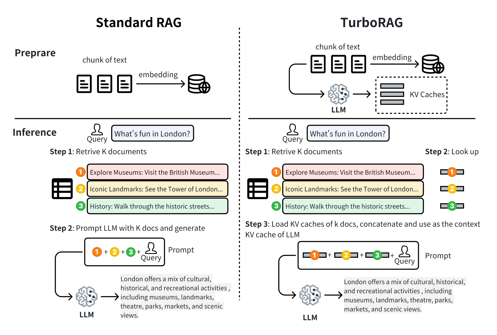

# TurboRAG



## Installation
```
conda create -n turborag python=3.10.12
conda activate turborag
pip install -r requirements.txt
```

## TTFT Testing
The following steps outline how to test TurboRAG against traditional RAG in terms of *time-to-first-token (TTFT)*. We provide some documents and related query examples located in the `documents` and `questions` directories. You can replace these with your own data as needed.
**Note**: In our testing, we utilized [LlamaIndex](https://github.com/run-llama/llama_index), which is essential for managing and querying the indexed documents efficiently. Make sure to install it as part of your environment setup.

### Step 1: Prepare Chunked Caches
Run `chunk_cache.py`. This script will automatically split the documents in the documents directory into chunks, each with a length of 512 tokens. The KV cache for each chunk will be stored in the chunk_kvcache directory.
### Step 2: Compare TTFT
Run `turbo_rag.py` to compare the TTFT of both methods.
```
python turbo_rag.py --model_name TURBORAG_MODEL_PATH --embedding_model_name BAAI/bge-small-en-v1.5  --similarity_top_k 10
```
### Results Summary
The following table summarizes the average TTFT when testing with 10 documents:

|  Method   | Average TTFT (s)  |
|  ----  | ----  |
| With KV Cache  | 0.65 |
| Without KV Cache  | 4.13 |

The results indicate that utilizing a KV cache significantly reduces the average TTFT from approximately 4.13 seconds to about 0.65 seconds, demonstrating the efficiency of TurboRAG with caching compared to the traditional RAG approach without caching. Additionally, as the number of documents increases, the speedup effect becomes even more pronounced.

